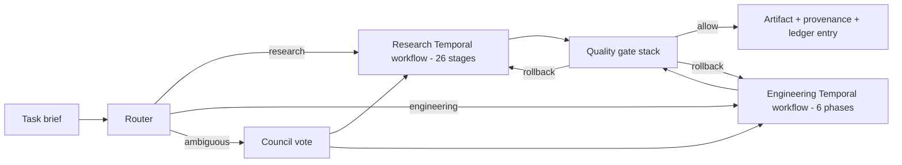

# ECC + Claw Autonomous Lab

Unified zero-human autonomous workgroup. Fuses the ECC agent/skill/eval fabric with Claw-AI-Lab's 26-stage research pipeline, layered with Temporal (durable workflows), LangGraph (per-stage state machines), an MCP security broker, tiered sandboxes, cost-aware model routing, and end-to-end eval + observability + provenance.

## Subsystems

| Path | Purpose |
|------|---------|
| `bridge/` | ECC <-> Claw integration glue: stage->skill mapping, hooks bridge, agent dispatcher |
| `orchestrator/` | Temporal workflows + LangGraph inner loops + work-item router |
| `quality_gates/` | Replaces HITL: eval-harness, GAN-evaluator, santa-method, gateguard, council |
| `mcp_broker/` | Policy-enforcing MCP proxy: per-role allow-lists, secret scrub, egress filter |
| `model_router/` | Cost-aware model selection with per-project budgets |
| `sandboxes/` | Tiered execution: process / docker / ssh / firecracker microVM / cloud burst |
| `provenance/` | Content-hash ledger + agent keypair signing + chain verification |
| `observability/` | OpenTelemetry + Langfuse + cost ledger |
| `researchclaw/` | Vendored Claw-AI-Lab backend (path-bridged or physically copied) |
| `api/` | FastAPI + WebSocket gateway backed by Temporal visibility API |
| `frontend/` | Extended React dashboard (vendored from Claw + new ECC components) |
| `harness-adapters/` | `/lab submit` adapters for Cursor, Claude, Codex, OpenCode, Gemini, Qwen, Zed |
| `scripts/` | Vendor scripts, start/stop scripts, cron schedulers |

## Two pipelines, one bus



## Zero-human rule

The 3 Claw HITL gates (`LITERATURE_SCREEN`, `EXPERIMENT_DESIGN`, `QUALITY_GATE`) and ECC's `orch-pipeline` GATE 1 / GATE 2 are replaced by the automated quality stack in `quality_gates/orchestrator.py`. Decisions are logged to the provenance ledger; humans can rollback any stage post-hoc via the dashboard, but they are never in the hot path.

## Run

```bash
# Vendor Claw-AI-Lab (one-time, if not using path-bridge mode)
node lab/scripts/vendor-claw.js

# Bring up the lab (Temporal + workers + MCP broker + API + dashboard)
node lab/scripts/start-lab.js

# Submit a task
npx ecc lab submit "Investigate whether attention sinks generalize to vision transformers"
npx ecc lab submit --engineering "Add WebAuthn login to the auth service"

# Verify provenance of a final artifact
npx ecc lab verify ./out/<project>/paper_final.md
```

See per-subsystem README files for details.
